# Los Angeles Metro Bike Sharing Network

This dataset is a catalogue of rides taken on the LA-Metro Bike Share Network.

"The Metro Bike Share system makes bikes available 24/7, 365 days a year in Downtown LA, Central LA, Port of LA and the Westside. Metro Bike Share offers convenient round-the-clock access to a fleet of bicycles for short trips. Metro Bike Share is one of LA Metro's multiple public transportation options for Angelenos and visitors to get around."
 -https://bikeshare.metro.net/about/

Bike sharing networks have been established in cities of all sizes, they allow residents and visitors a fun, cheap, fast and  easy way to explore the city they are based in and have even become part of regular commuter routines. Although a bicycle is in itself a low-tech transport option, technology has and will continue to play major role in the rapid expansion of bike sharing networks. The bike may be dumb (and they increasingly aren't) but the network itself is very smart.

"Now companies have GPS sensors to track their bikes, and smartphones, credit cards, or transit passes to know who has them—and whom to penalize if the wheels go missing. Riders, meanwhile, can use apps to track down available rides or bike-share stations when they need them."
 -Wired Magazine (https://www.wired.com/story/americans-falling-in-love-bike-share/)

And data collection and analysis and with it machine learning is the key to building a bike network that really works. Data can provide many insights and much guidance about a bike sharing network and through this exploration of the LA-Metro Bike Network I hope to demonstrate just some of this potential.

Datset obtained from:

https://www.kaggle.com/cityofLA/los-angeles-metro-bike-share-trip-data

Full Notebook here:

https://github.com/ktzioumis/LA-Bike-Share/blob/master/index.ipynb

## The Data 

<i>Feature descriptions from https://bikeshare.metro.net/about/data/</i>

<b>trip_id:</b> Locally unique integer that identifies the trip

<b>duration:</b> Length of trip in <i> minutes*</i>

<b>start_time:</b> The date/time when the trip began, presented in ISO 8601 format in local time

<b>end_time: </b>The date/time when the trip ended, presented in ISO 8601 format in local time

<b>start_station:</b> The station ID where the trip originated 

<b>start_lat:</b> The latitude of the station where the trip originated

<b>start_lon: </b>The longitude of the station where the trip originated

<b>end_station: </b>The station ID where the trip terminated 

<b>end_lat: </b>The latitude of the station where the trip terminated

<b>end_lon: </b>The longitude of the station where the trip terminated

<b>bike_id: </b> Locally unique integer that identifies the bike
    
<b>plan_duration: </b>The number of days that the plan the passholder is using entitles them to ride; 0 is used for a single ride plan (Walk-up)

<b>trip_route_category:</b> "Round Trip" for trips starting and ending at the same station or "One Way" for all other trips

<b>passholder_type: </b>The name of the passholder's plan

*units are actually in seconds but each instance is a multiple of 60 i.e. a whole minute number. We will convert this to minutes

Other features are not officially described by Metro Bike Share

Starting Lat-Long and Ending Lat-Long appear to be repetitions of previous station data and can be dropped safely

Remaining features appear to be LA geographic information not relevant to this study, many of which include large amounts of missing data. These will  also be dropped.

There is some missing data for latitudes and longitudes but since these are linked to specific bike station ID's the missing values can be imputed from the known bike station latitude and longitude.

## Mapping the Network

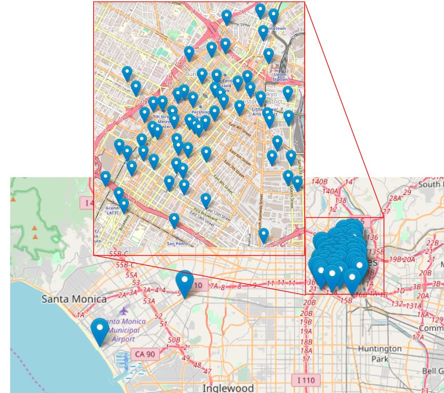

Downtown LA is home to a dense network of bicycle stations, they are conveniently close-by for anyone in need of a ride or looking to drop-off at their destination. There are 2 additional stations outside the downtown area at Culver City and Venice by the beach. These stations only have rides attributed to them at the very end of our dataset's time period and appear to represent new additions to the network.

## Ridership and Time

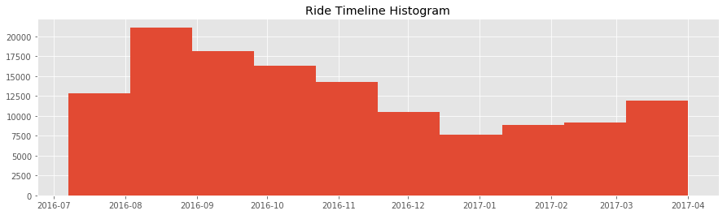

Rides data is assumed to be complete over the time period starting from the 7th of July 2016 to the 31st of March 2017. In the above histogram we can see the growth in popularity over the summer months. Ridership declines as summer turns into autumn turns into winter dropping to its lowest point in what we would expect to be the coldest part of winter of 2017 and then increasing as spring begins to arrive. Unfortunately the time period encompasses less than 1 year so we are unable to observe a full cyclical seasonality on ridership

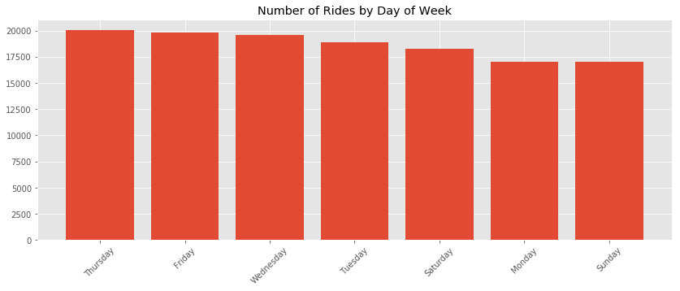

Ridership does vary by day of the week but without a clear weekday vs weekend divide

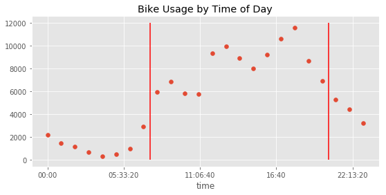

Across the day, the bike network usage clearly has a peak time seen between the red bars above

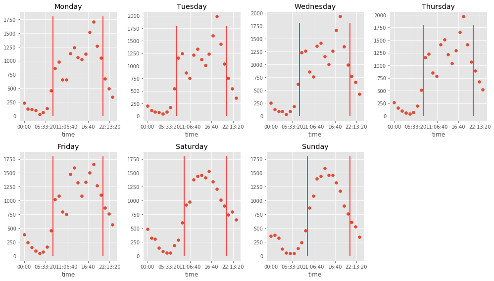

People like to sleep in on the weekends, move the start of peak bar up 2 hours on saturday and sunday

We will create a feature called 'Peak' to describe this On-Peak vs Off-Peak difference and a feature called 'Time Only Int' to simplify our Start Time for later usage

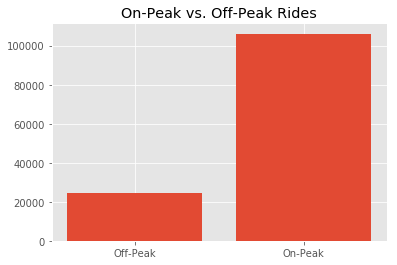

80% of all rides occur during the peak times identified above

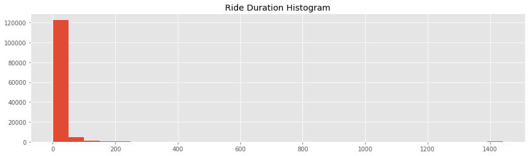

Ride Duration is very heavily left skewed, most rides are very short but there is a very long tail out to a max of 1440 minutes which is rides lasting longer than a full day

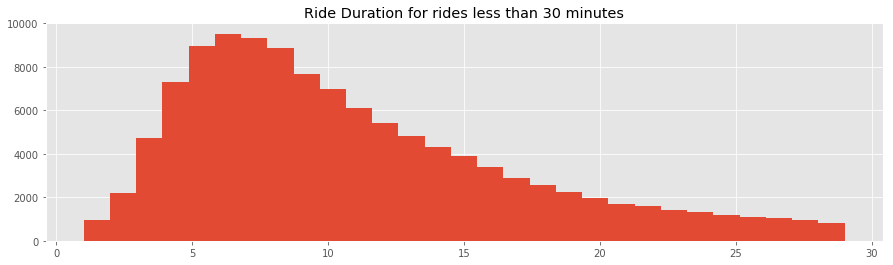

89% of rides are 30 minutes or less. and in this range are normally distributed. All rides longer than 30 minutes will be rounded down to 30 to prevent the extreme outliers from exerting undue influence on our machine learning models.

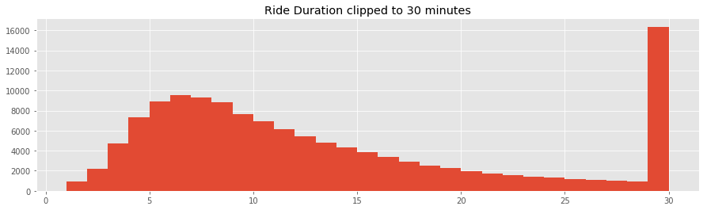

## Classifier Model for Passholder Type

### Can we predict what kind of membership the ride taker holds?

There are multiple types of network membership and each are bound to attract riders with different wants or expectations. An understanding of how and why these riders fit into these particular categories is invaluable for understanding rider behavior attracting new riders and ultimately growing the LA bike share network.

Categorical features are one-hot encoded, all features are scaled and dimensionality is reduced to 20 with 98% of explained variance retained

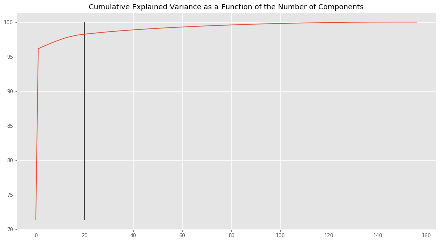

3 model types are considered  - Random Forest Classifier, ADABoost Classifier and XGBoost Classifier. All are tested on 75% of the data as a training set with hyperparameters tuned using Grid Search with 3-fold cross validation.

XGBoost performs the best with overall score of 74% accuracy and perhaps most significantly it was able to attribute some predictions to our least common membership type, the Flex-Pass holders. The underrepresentation of Flex Pass holders in the dataset makes prediction tricky and there are techniques for resampling to overcome this, they are beyond the scope of this project

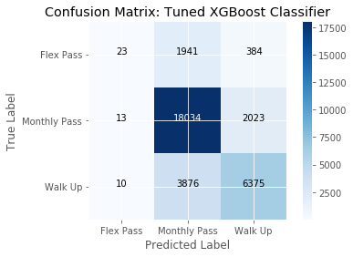

## Conclusion

Machine Learning models are valuable tools for analysing the LA-Metro Bike Sharing Network.
  We have demonstrated accurate models of the riding patterns of different membership types with a 74% prediction accuracy.

## Future Work

1. Current dataset covers 9 months, updated data lengthening the timescale will allow for year on year factors to be accounted for. 
2. Time is binned by hour in this exercise, more detailed usage of time series data may improve accuracy. 
3. Resampling method such as SMOTE for Classification models to boost accuracy for Flex Pass membership prediction. 
4. Extract most influential features from models and explore their influence on ridership.  
5. Tune Classification models based on business case for maximizing accuracy in relation to a particular Membership Type with the goal of guiding membership in that direction. 
